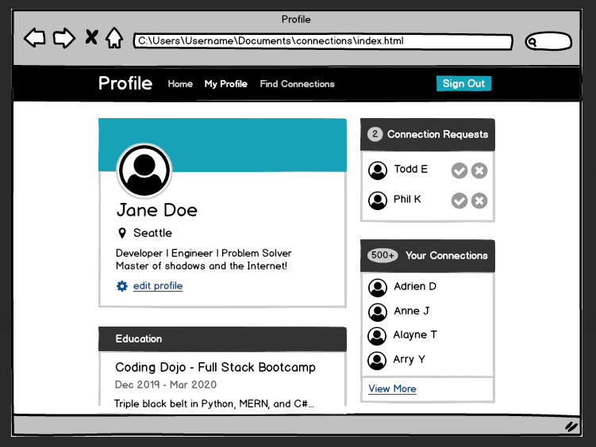
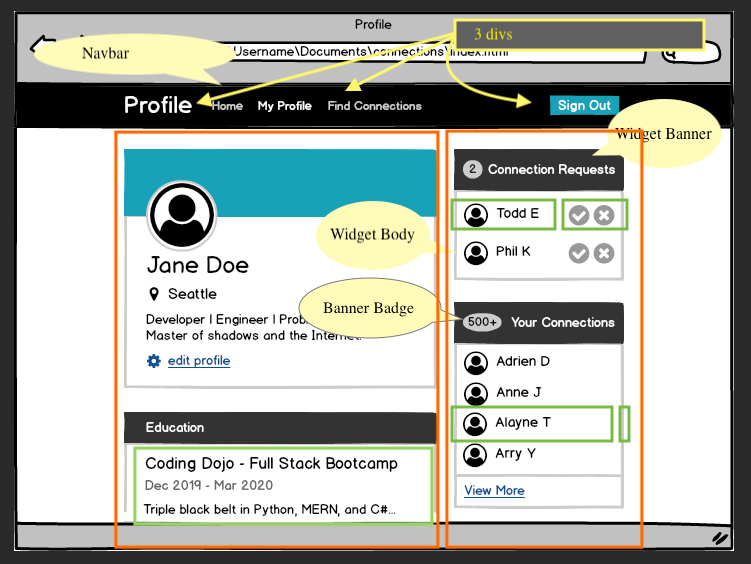
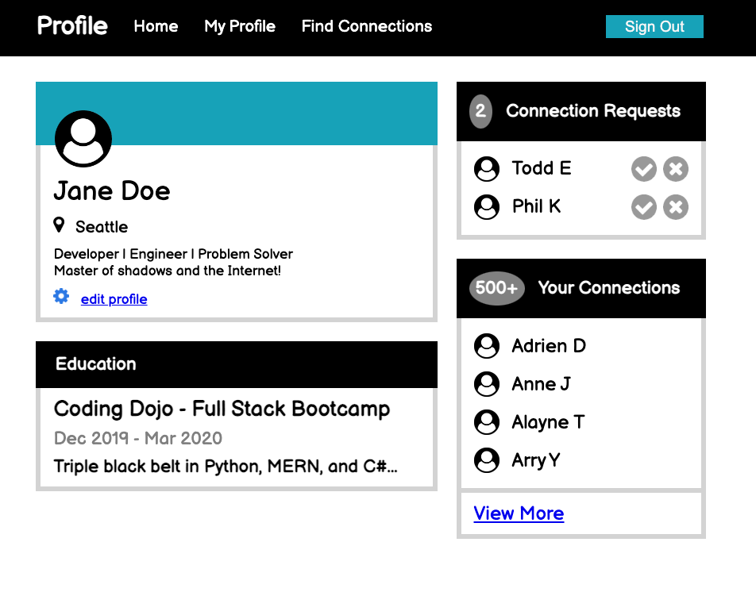

# Profile Page

Build off the previous assignments to create this wireframe.

## The Wireframes



I'd worked up the following as an annotated wireframe to decompose the given image to start building from.



## The Journey

After slogging away for far too long, (far, far, far too long), I had a working implementation ready for feedback.  Earlier, I'd gotten good value from pairing with Danny, then comparing notes with Kyle about his version.  Eventually, Kyle lent an eye to a pre-final draft of mine.  With his input, I was able to make final adjustments until my version looked functional.  I wish that I'd noted better which changes were made when, which were inspired by the other guys and which were Rubber Ducked, but I'm in a fog at this point.

Eventually, my page as I am ready to submit it, looks like this:


## Code review

Around when I was ready to submit, Kyle & I both popped into Christian's office hours to ask for code reviews.  He had similar feedback for us both. ("Yay! I'm making common mistakes!")

Trying to remember and demonstrate the suggestions that were specific to my code. These aren't in any particular order.
**All code modifications below are approximations, NOT taken from live code.**

`<p> ... </p>` tags generally should only contain text or text-centric tags (`<span>`s or direct text), and I should use combination selectors rather than classes when possible.

Rather than

```html
<div class="widget-body">
    <div class="experience">
        <h2>Coding Dojo - Full Stack Bootcamp</h2>
        <p class="experience-dates">Dec 2019 - Mar 2020</p>
        <p class="experience-detail">Triple black belt in Python, MERN, and C#...</p>
    </div>
</div>
```

I could've done something like:

```html
<div class="widget-body">
    <h2>Coding Dojo - Full Stack Bootcamp</h2>
    <span class="gray">Dec 2019 - Mar 2020</span>
    <p >Triple black belt in Python, MERN, and C#...</p>
</div>
```

with

```css
.gray {
    color: gray;
}
```

Since `<li>`s function as special purpose containers, they can directly contain multpile elements between the opening and closing tags.

So, instead of

```html
<div class="widget-body">
    <ul class="ul-of-people">
        <li>
            <div class="left-just">
                
                <div class="request-options">Todd E</div>
            </div>
            <div class="right-just">
                
                
            </div>
        </li>
        <!-- more <li>s -->
    </ul>
</div>
```

I could have simplified the html similar to the following.

```html
<div>
    <ul class="ul-of-people">
        <li>
            
            <span>Todd E</span>
            
            
        </li>
        <!-- more <li>s -->
    </ul>
</div>
```

And instead of using so many classes, I could've used combination selectors to format both widget-body lists at once.

```css
.widget-body>ul { 
    display:flex; 
    align-content: center;
}
.widget-body li {
    gap: 1rem;
}
.widget-body li>img {
    height: 2rem;
    flex: 0 0 auto;
}
.widget-body span {
    flex: 1 0 auto;
}
```

Another valuable piece of feedback was that my css could be both more concise and easier to follow if I reduced and reused functionality through combination selectors instead of classes.  The combo selectors would lend themselves to being located near their parent scope rather than scattered according to where I first thought of something.

This would have encouraged me to push certain functionality up from child contexts to its parent context, e.g. `align-context` in the parent instead of `align-self` in multiple child contexts.

Christian observed that careful construction of the css file could've been **33-50%** shorter (in terms of LOC).

### Other Nuggets

- The size of a container should be determined by the needs of its contents.
- The placement of a child should be handled by its parent.

I missed several important things:

- My `header>nav` isn't put in place as a real nav, it's just text
- I redefined font-sizes in several places instead of setting it from a combination selector in a parent context
- In the navbar, **Profile** should be bolded or bigger or whiter than the other links
- I shouldn't set specific `height` or `weight` on elements that aren't images
  - For instance, the width of the navbar or `<main>`
  - Then instead of `center`ing or setting justification on these elements, it would be better to use `padding`
- Flexing the user image down from the top of its parent's top using `margin`/`top`is hack-y.
  - The **Position** lesson preceded this. From context, I should've leaned into that and used relative positioning.
  - In that case, I'dve also used a combination selector to adjust the `#contact-card.widget-body { padding-top: 2rem; }` or soemthing like that to create the additional area needed
  - `.avatar { margin: 4rem 0rem 0rem 0.5rem; }` is  ***smelly*** and points to the flaw
- There are multiple places in my css where I'm restating defaults, have *do-nothing* actions or inappropriately manipulate a child context element that I could do in the parent context
- Christian improved my attempts at responsive design by adding `.main { /* ... */ flex-wrap: wrap; }` so the right column will wrap under the left on a too-narrow viewport

***

Christian encouraged me to implement as much generic & reusable functionality as I can into a css library to import into my projects. E.g.

```css
/* Not comprehensive */
.center { justify-content: center; }
.flex { display:flex; }
.red { color: red; }
.bg_black { background-color: black; }
```

...There was certainly more, but I'm in a brain fog atm
